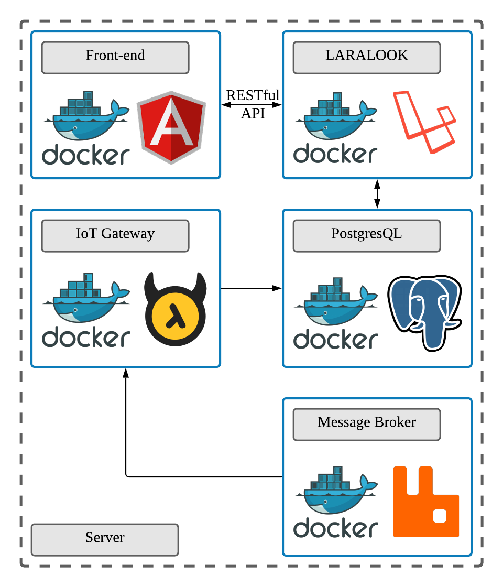

## LARALOOK (FYP)

The back-end of the flood monitoring system (LARALOOK) is my Final Year Project aims to provide a flood early warning for the users within a certain area where the system receives the data from the IoT devices and stores it into the database besides preparing APIs for the front-end client to consume. 

## Architectural Design

Overall, the flood monitoring system was divided into three main components:
- IoT device 
- back-end (LARALOOK)
- front-end

Starting from IoT devices, it sends data to be stored into the database and managed by LARALOOK through IoT gateway using MQTT broker. The IoT gateway must be connected to the database. 

Second, the LARALOOK acts as a middleware and application server between the IoT gateway and front-end. Apart from database management, LARALOOK also provides resources to be used by the clients via RESTful APIs. 

Lastly, the client will consume and display all the data into charts, graphs or any types of data representation that will be viewable by the users.

## Model-View-Controller 

There are three levels of MVC architecture: 
- model
- view
- controller

The model is the part that interacts with the database to handle the data, logic and the rules. The view forms the part that interacts with the user by displaying the output and accepting the input in various forms. The controller sends commands to the model to update the data as well as send commands to the view to modify the data being accepted or displayed.

## RESTful API

RESTful API is used in this system for the communication between the clients and the server.

Representational state transfer (REST) or RESTful web services is a way of providing interoperability between computer systems on the Internet. REST-compliant Web services allow requesting systems to access and manipulate textual representations of Web resources using a uniform and predefined set of stateless operations.

## PostgreSQL/MySQL

LARALOOK possesses four tables including 
- stations
- river level records
- temperature records
- water flow records

## Docker

Microservices were also used during the development phase as well as the production phase.

All of the flood monitoring system components were containerized by using docker container before deploying to the server in order to optimize resources.

## Interfaces

